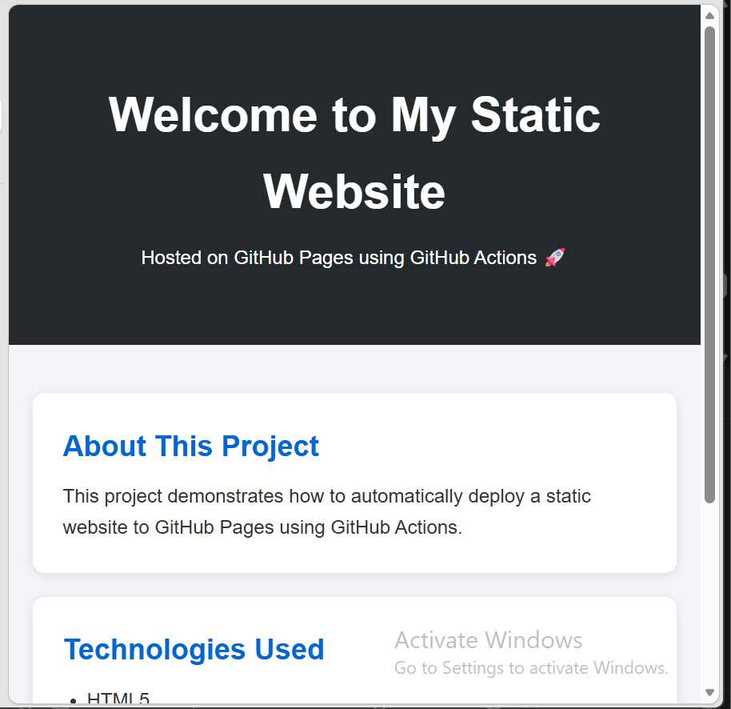

# Project Title
A Static Website Deployed via GitHub Pages

## Overview
This project demonstrates a CI/CD pipeline for deploying a static website using GitHub Actions and GitHub Pages. It was built to practice automating deployments; every push to `main` triggers a workflow that builds and publishes the site with zero manual steps.

## Tech Stack
- HTML 5
- CSS 3
- GitHub Actions (CI/CD)
- GitHub Pages (hosting)

## Project Structure

```
.
├──.github
|    └──  workflows
|        └── deploy.yanl
├── website
|    ├── index.html
|    └── styles.css
└── README.md
```

## Setup
1. Create a simple static website and push to GitHub Repository.
```bash
git init
git add .
git commit -m "initial commit"
git remote add origin <github_repo_url>
git push -u origin main
```

## Setup GitHub Pages
Here's a guide on how the GitHub pages were setup 
- Go to your repoitory **Settings**  → **Pages** 
- Under **Build and deployment**, set **Source** to `GitHub Actions`
- Push to `main` for the workflow to handle the deployment.

## Deployment
This project uses a GitHub Actions workflow (/github/workflows/deploy.yaml) to automatically deploy to GitHub Pages whenever changes are pushed to the main branch.

1. Go to repository GitHub Actions, navigate to **Pages** → **Static HTML**
2. Click on **Configure** in Static HTML.
3. Modify yaml file (optional) and click on **Commit changes**
4. Go to workflows page, you static website url is displayed there if the workflow runs successfully.

## The Preview of the Website



